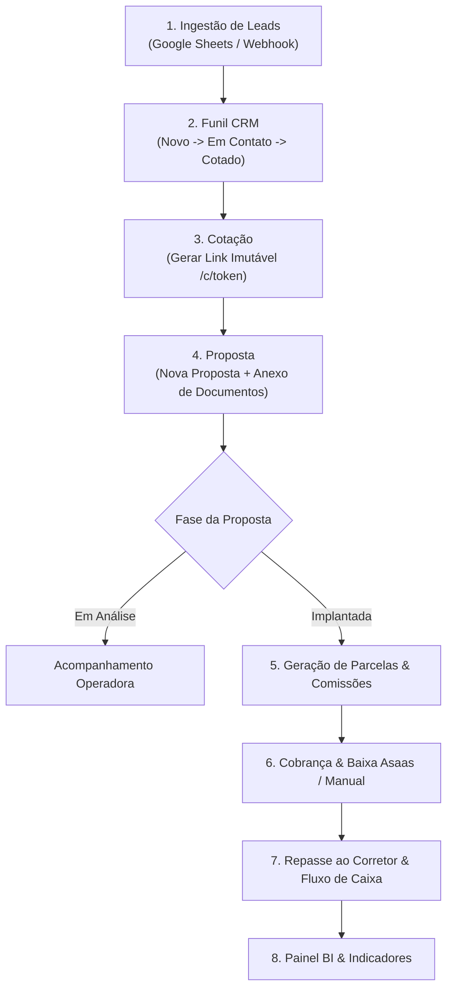
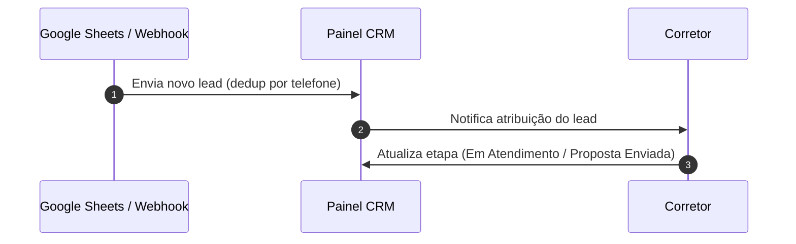
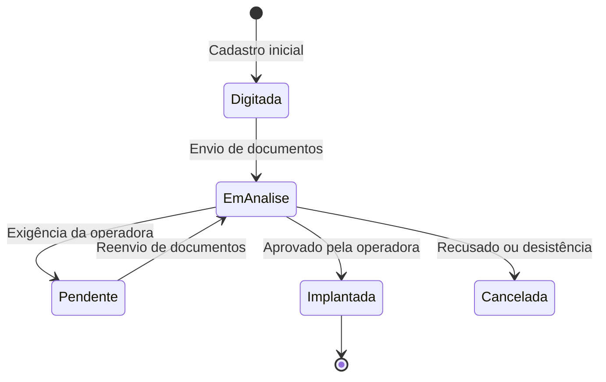
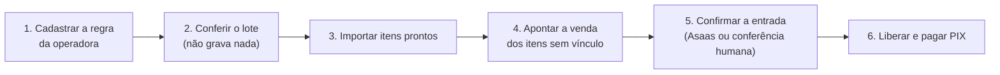

# GUIA OPERACIONAL E VISUAL — JOB SERENUS

Este manual descreve o funcionamento do sistema JOB Serenus, os fluxos operacionais de ponta a ponta e como os usuários (Corretores, Gestores, Financeiro e Admin) devem operar cada módulo.

---

## 1. Visão Geral do Fluxo Operacional

O diagrama abaixo ilustra o ciclo de vida completo de um atendimento na Serenus: desde a entrada do lead até a liquidação financeira e análise no BI.



---

## 2. Mapa de Operação por Perfil de Usuário

| Módulo | Corretor | Gestor / Supervisor | Financeiro / Admin |
|---|---|---|---|
| **CRM (Leads)** | Recebe e atende leads atribuídos | Atribui leads, altera etapas e vê painel geral | Configura etapas e regras de distribuição |
| **Cotação** | Gera cotação e envia link ao cliente | Revisa cotações enviadas | Atualiza tabelas de preços operadoras |
| **Propostas** | Digita proposta e envia anexos | Aprova e altera fases da proposta | Edita valores, datas e vigência |
| **Financeiro** | Visualiza extrato de repasses | Visualiza relatórios de comissão | Baixa parcelas, realiza repasses e estornos |
| **BI / Relatórios** | Vê produção individual | Vê produção da equipe | Acesso a todas as APIs e métricas globais |

---

## 3. Passo a Passo Operacional por Módulo

### Módulo 1: CRM e Gestão de Leads

> [!NOTE]
> Leads entram automaticamente a cada 10 minutos via integração com planilhas do Google ou webhooks.



**Como operar:**
1. Acesse o menu **CRM**.
2. Clique no lead desejado para abrir o painel lateral de detalhes.
3. Arraste a carta do lead no **Painel Kanban** para atualizar a etapa do funil.
4. Ao converter o atendimento em venda, clique em **Gerar Proposta a partir do Lead**.

---

### Módulo 2: Gerador de Cotações

> [!IMPORTANT]
> O link gerado `/c/<token>` é público e imutável. Caso haja necessidade de ajustes nos planos após o envio, o sistema gera uma nova versão para manter o histórico.

**Como operar:**
1. Acesse o menu **Cotação**.
2. Selecione a operadora, tipo de plano (Individual, PME, MEI) e idades dos beneficiários.
3. Clique em **Gerar Cotação**.
4. Copie o link curto gerado (`/c/<token>`) e envie ao cliente por WhatsApp ou e-mail.

---

### Módulo 3: Emissão e Acompanhamento de Propostas



**Como operar:**
1. Acesse **Propostas** > **Nova Proposta**.
2. Preencha os dados da proposta (Cliente, CPF, Operadora, Produto, Valor da Mensalidade e Vigência).
3. Na aba **Anexos**, faça o upload da documentação (RG/CPF, Comprovante de Residência, Cartão SUS/Declaração de Saúde).
4. Altere a fase da proposta conforme o andamento junto à operadora.

---

### Módulo 4: Gestão Financeira (Parcelas, Boletos e Repasses)

> [!TIP]
> A transição da proposta para a fase **Implantada** gera automaticamente o cronograma de parcelas e o cálculo de comissões/repasses para o corretor.

**Como operar:**
1. Acesse o menu **Financeiro** ou abra a proposta em **Propostas** > **Detalhe**.
2. **Boletos de Adesão / PIX:** Gere a cobrança via Asaas diretamente pela tela da proposta.
3. **Baixa de Parcelas:** Quando o cliente pagar, confirme a liquidação para autorizar a liberação do repasse.
4. **Repasses a Corretores:** Em **Financeiro** > **Repasses**, selecione os repasses liberados e confirme a transferência.

---

### Módulo 5: Comissão da Affinity — do PDF ao PIX

> [!IMPORTANT]
> **O extrato da Affinity é valor apurado, não é dinheiro na conta.** O PDF diz o que ela apurou e
> informa que vai pagar. Ele não prova entrada bancária: o extrato pode estar previsto, ter sido
> transferido para outro extrato, ser antecipação sobre parcela futura, ou ser pago em data
> diferente da previsão. A confirmação de que o dinheiro entrou vem da conciliação, nunca do PDF.

O caminho tem seis passos e eles são sempre nesta ordem. Pular um só é possível quando não há
dinheiro envolvido.



**Passo 1 — Cadastrar a regra da operadora.** Em **Comissões > Regra do gestor**, cadastre por
operadora, variação e plano: quantas frações a operadora paga e em que percentual (régua de
recebimento), quanto de cada fração é do gestor (régua do gestor) e as retenções (com alíquota,
base de cálculo e responsável). O botão *Sugerir 100% na primeira, 0% nas demais* preenche a
distribuição combinada, mas **é sugestão**: só vale depois que você conferir e marcar a
confirmação. Enquanto a regra estiver incompleta, as vendas daquela operadora não geram
financeiro, não podem ser liberadas e não pagam PIX — a venda continua cadastrada e pode ficar em
rascunho, só o dinheiro fica parado. Alíquota que você ainda não sabe deve ficar **em branco**:
em branco trava e pede resposta; zero digitado é uma decisão e o sistema vai calcular com ela.

**Passo 2 — Conferir o lote.** Em **Comissões > Extratos**, clique em *Conferir um lote sem
gravar*. Suba todos os PDFs de uma vez (até 60). A tela lê tudo e não grava nada: nenhuma
proposta, parcela, recebimento, repasse ou lançamento é criado ou alterado. Olhe primeiro os
arquivos marcados como **leitura incompleta** — neles a soma das linhas não bateu com o total
impresso no próprio PDF, e importar assim lançaria comissão pela metade. Depois olhe
**duplicados** (código já importado ou repetido no lote), **sem proposta** e **ambíguos** — os
dois últimos são coisas diferentes: "não existe venda" e "existe mais de uma candidata".

**Passo 3 — Importar itens prontos.** Ainda na tela da conferência, clique em *Importar itens
prontos*. Entra apenas o que está pronto: leitura fechada, código novo e arquivo íntegro. Item
cujo número de proposta não casou entra assim mesmo, sem venda apontada, e vai para a fila de
revisão — nome parecido nunca vira vínculo sozinho. Importar duas vezes o mesmo lote não duplica
nada.

**Passo 4 — Apontar a venda.** Em **Comissões > Conciliação**, filtro *Sem venda vinculada*. Para
cada linha, use a sugestão por nome ou busque a venda pelo número. O sistema pede o motivo por
escrito, e ele fica registrado com seu nome e a data. Vínculo não se sobrescreve.

**Passo 5 — Confirmar a entrada.** Só depois que o dinheiro aparecer na conta. Cole o
identificador da transação no Asaas ou use *Confirmar manualmente*, escrevendo como você conferiu.
Valor e data parecidos não confirmam nada e não há caminho no sistema que aceite isso.

**Passo 6 — Liberar e pagar.** Com a regra completa e a entrada confirmada, libere a parcela e
dispare o PIX pelo caminho de sempre, na proposta ou no Fluxo de Caixa.

**Onde conferir o resultado.** O painel *Comissão da Affinity: do apurado ao pago* aparece igual
no **Financeiro** e no **Fluxo de Caixa**, com os mesmos números, porque as duas telas leem a mesma
fonte. Ele mostra, nesta ordem: bruto esperado, apurado pela Affinity, entrada confirmada, bruto do
gestor, retenção, líquido para PIX e saldo Serenus. Verde é sempre dinheiro que entra; o que a
empresa deve aparece na cor de saída.

**Histórico.** Para ver o que mudaria nas vendas antigas se a regra de hoje valesse para elas, use
**Regra do gestor > Simular no histórico**. A tela não muda nada: mostra atual, simulado e a
diferença. Aplicar é uma decisão separada, venda por venda, com confirmação digitada — e vendas
com parcela paga, conciliada ou com PIX iniciado são recusadas mesmo que você as marque.

---

## 4. Guia de Operação com o Agente de IA (Para Desenvolvedores/Admins)

Para manter a velocidade e precisão ao solicitar alterações no sistema:

1. **Especifique o Módulo:** Use os nomes dos módulos conforme o [MAPA_MODULOS.md](file:///Users/guilhermesantos/Desktop/job-serenus/MAPA_MODULOS.md) (ex: "No módulo Financeiro...", "No módulo CRM...").
2. **Consulte a Matriz de Impacto:** Lembre-se que alterações em Propostas impactam Financeiro, CRM e BI.
3. **Solicite mudanças cirúrgicas:** Indique exatamente a rota ou função a ser alterada.

---

## 5. Regras Globais de Uso e Design

- **Sem Emojis:** Nenhuma tela, botão ou mensagem deve conter emojis.
- **Ajuda Visual:** Dúvidas ou conceitos avançados possuem um ícone de informação "i" explicativo ao lado.
- **Menu do Sistema:** O menu é otimizado com ~25 itens. Novas funcionalidades devem ser encaixadas em menus existentes.
- **Apurado, confirmado e pago são estados diferentes:** nenhuma tela pode chamar de "recebido" o
  que ainda não foi conciliado com o banco.

---

## 6. Testes automatizados

Rodam em SQLite local e **nunca** encostam no Postgres de produção. A variável `JOB_MODO_TESTE=1`
desliga o APScheduler e o auto-pull de leads, para que nenhum job de fundo grave no banco no meio
de um teste — sem ela, o teste de invariância acusa a tela errada por um estrago que não foi dela.
Produção nunca define essa variável.

```
JOB_MODO_TESTE=1 JOB_DATA_DIR=/tmp/jobtest python3 testes/rodar_todos.py
```

| Arquivo | O que protege |
|---|---|
| `testes/testar_extrato_previa.py` | Leitura dos 32 PDFs, fechamento com o total impresso, e a invariância: conferir extrato não pode gravar nada |
| `testes/testar_conciliacao_affinity.py` | Idempotência da importação, propostas e parcelas intocadas, entrada confirmada só com prova, vínculo manual auditado |
| `testes/testar_regra_gestor.py` | Regra incompleta bloqueia, alíquota ausente não vira zero, snapshot imutável, liberação e PIX recusados |
| `testes/testar_financeiro_integrado.py` | Vencimento de parcela mês a mês (política do dia 31), simulador que não escreve, histórico protegido, exportação com escopo declarado |
| `testes/rodar_todos.py` | Roda os quatro acima em sequência e ainda testa rota antiga de proposta, prévia de antecipação e abertura de anexo |
