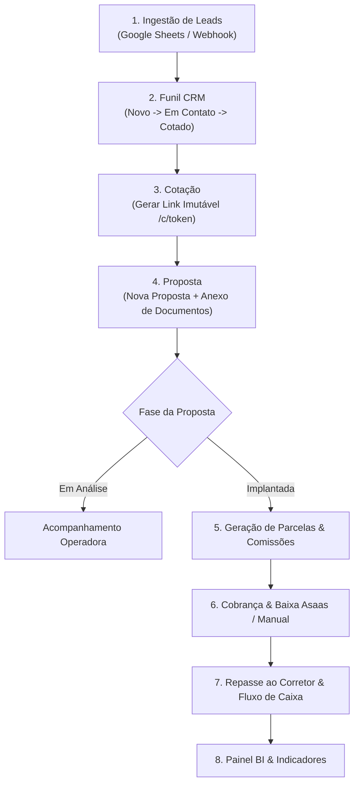
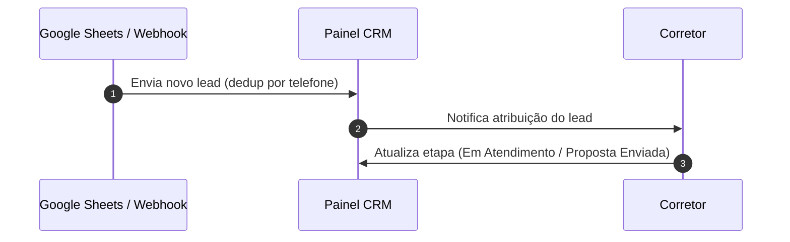
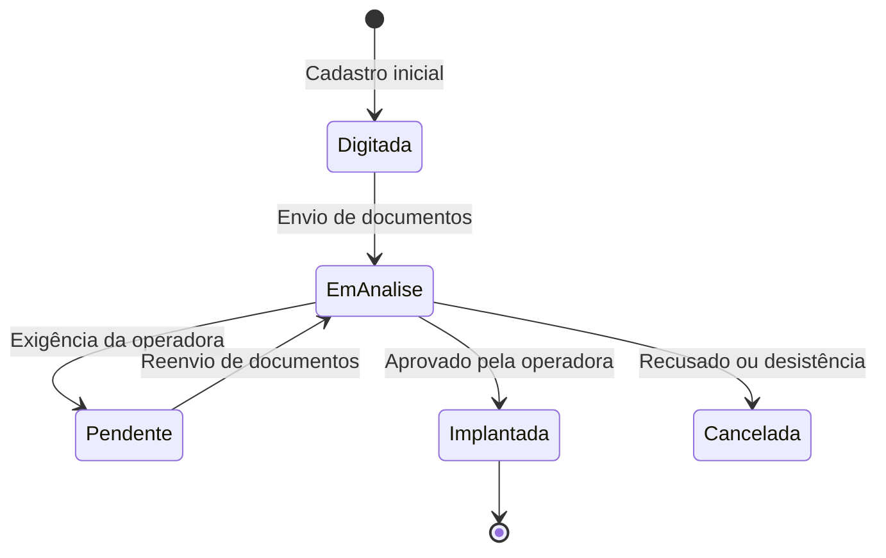

# GUIA OPERACIONAL E VISUAL — JOB SERENUS

Este manual descreve o funcionamento do sistema JOB Serenus, os fluxos operacionais de ponta a ponta e como os usuários (Corretores, Gestores, Financeiro e Admin) devem operar cada módulo.

---

## 1. Visão Geral do Fluxo Operacional

O diagrama abaixo ilustra o ciclo de vida completo de um atendimento na Serenus: desde a entrada do lead até a liquidação financeira e análise no BI.

---

## 2. Mapa de Operação por Perfil de Usuário

| Módulo | Corretor | Gestor / Supervisor | Financeiro / Admin |
|---|---|---|---|
| **CRM (Leads)** | Recebe e atende leads atribuídos | Atribui leads, altera etapas e vê painel geral | Configura etapas e regras de distribuição |
| **Cotação** | Gera cotação e envia link ao cliente | Revisa cotações enviadas | Atualiza tabelas de preços operadoras |
| **Propostas** | Digita proposta e envia anexos | Aprova e altera fases da proposta | Edita valores, datas e vigência |
| **Financeiro** | Visualiza extrato de repasses | Visualiza relatórios de comissão | Baixa parcelas, realiza repasses e estornos |
| **BI / Relatórios** | Vê produção individual | Vê produção da equipe | Acesso a todas as APIs e métricas globais |

---

## 3. Passo a Passo Operacional por Módulo

### Módulo 1: CRM e Gestão de Leads

> [!NOTE]
> Leads entram automaticamente a cada 10 minutos via integração com planilhas do Google ou webhooks.

**Como operar:**
1. Acesse o menu **CRM**.
2. Clique no lead desejado para abrir o painel lateral de detalhes.
3. Arraste a carta do lead no **Painel Kanban** para atualizar a etapa do funil.
4. Ao converter o atendimento em venda, clique em **Gerar Proposta a partir do Lead**.

---

### Módulo 2: Gerador de Cotações

> [!IMPORTANT]
> O link gerado `/c/<token>` é público e imutável. Caso haja necessidade de ajustes nos planos após o envio, o sistema gera uma nova versão para manter o histórico.

**Como operar:**
1. Acesse o menu **Cotação**.
2. Selecione a operadora, tipo de plano (Individual, PME, MEI) e idades dos beneficiários.
3. Clique em **Gerar Cotação**.
4. Copie o link curto gerado (`/c/<token>`) e envie ao cliente por WhatsApp ou e-mail.

---

### Módulo 3: Emissão e Acompanhamento de Propostas

**Como operar:**
1. Acesse **Propostas** > **Nova Proposta**.
2. Preencha os dados da proposta (Cliente, CPF, Operadora, Produto, Valor da Mensalidade e Vigência).
3. Na aba **Anexos**, faça o upload da documentação (RG/CPF, Comprovante de Residência, Cartão SUS/Declaração de Saúde).
4. Altere a fase da proposta conforme o andamento junto à operadora.

---

### Módulo 4: Gestão Financeira (Parcelas, Boletos e Repasses)

> [!TIP]
> A transição da proposta para a fase **Implantada** gera automaticamente o cronograma de parcelas e o cálculo de comissões/repasses para o corretor.

**Como operar:**
1. Acesse o menu **Financeiro** ou abra a proposta em **Propostas** > **Detalhe**.
2. **Boletos de Adesão / PIX:** Gere a cobrança via Asaas diretamente pela tela da proposta.
3. **Baixa de Parcelas:** Quando o cliente pagar, confirme a liquidação para autorizar a liberação do repasse.
4. **Repasses a Corretores:** Em **Financeiro** > **Repasses**, selecione os repasses liberados e confirme a transferência.

---

## 4. Guia de Operação com o Agente de IA (Para Desenvolvedores/Admins)

Para manter a velocidade e precisão ao solicitar alterações no sistema:

1. **Especifique o Módulo:** Use os nomes dos módulos conforme o [MAPA_MODULOS.md](file:///Users/guilhermesantos/Desktop/job-serenus/MAPA_MODULOS.md) (ex: "No módulo Financeiro...", "No módulo CRM...").
2. **Consulte a Matriz de Impacto:** Lembre-se que alterações em Propostas impactam Financeiro, CRM e BI.
3. **Solicite mudanças cirúrgicas:** Indique exatamente a rota ou função a ser alterada.

---

## 5. Regras Globais de Uso e Design

- **Sem Emojis:** Nenhuma tela, botão ou mensagem deve conter emojis.
- **Ajuda Visual:** Dúvidas ou conceitos avançados possuem um ícone de informação "i" explicativo ao lado.
- **Menu do Sistema:** O menu é otimizado com ~25 itens. Novas funcionalidades devem ser encaixadas em menus existentes.
